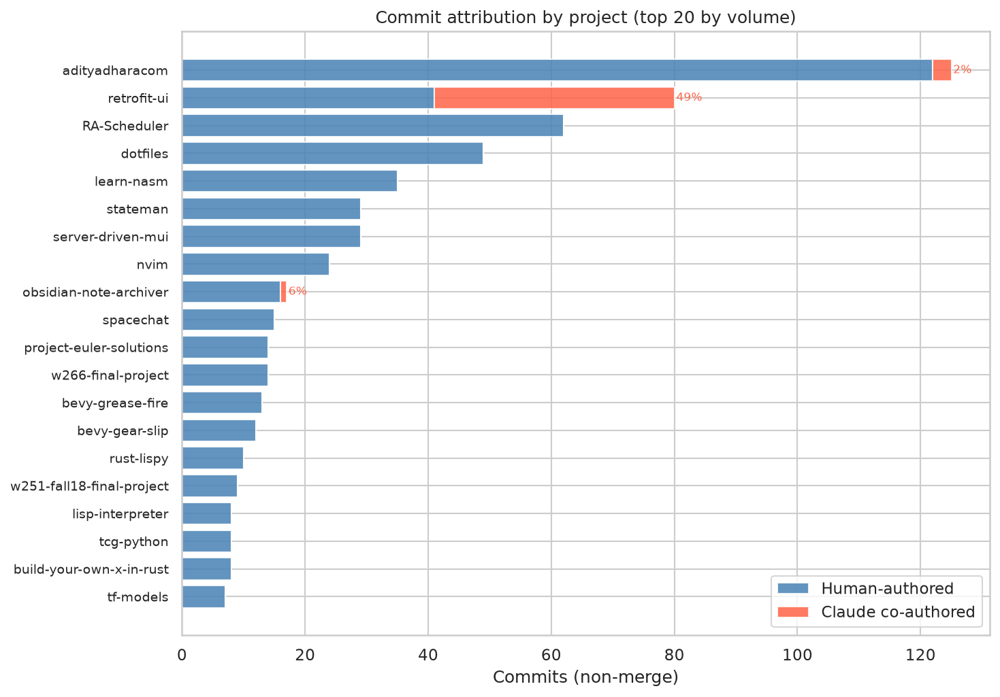
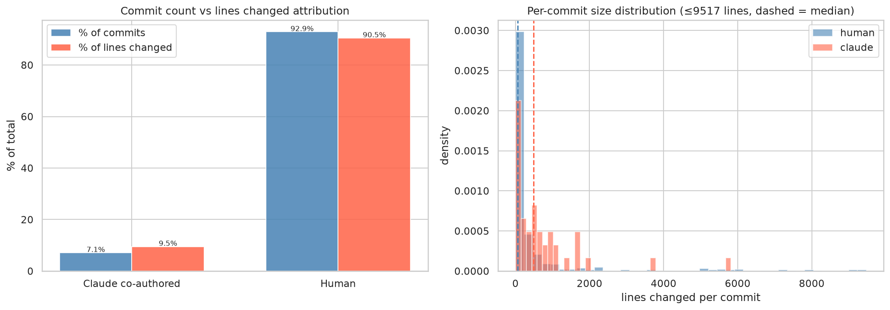
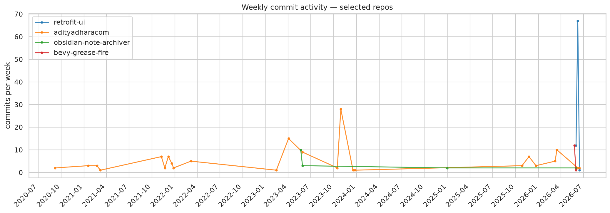
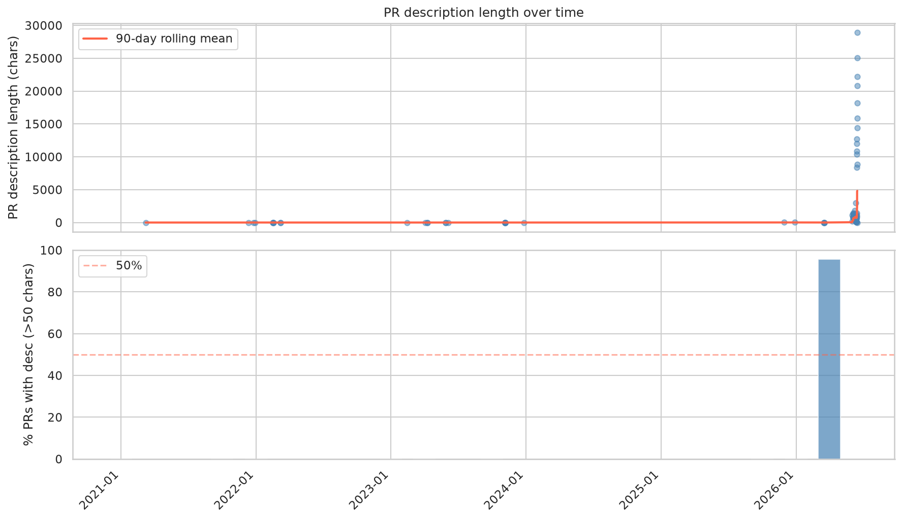
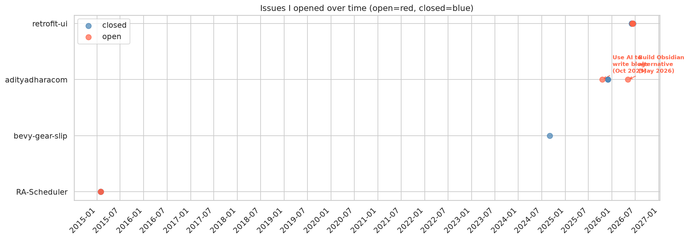
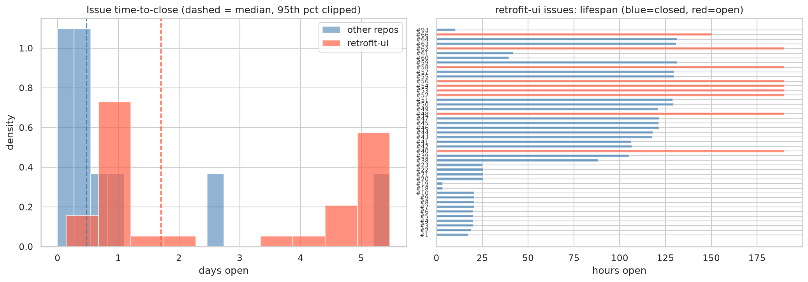

## The claim I keep hearing

My own experiences with AI have been mixed, and my hard earned education helped
me become even more confused about it. Mathematics made me confused enough about
the probability theory, introductory linguistics made me confused about language
models. This is a tangent but this is my blog so we're going on one: Entering
the search ecosystem was also an interesting stroke of luck -- I joined wayfair
as a starting engineer in their "labs" program which gave us one month to work
on pipe-dream projects which actual expensive yet revenue-generating engineers
don't want to waste their time on. I was tasked to create a search bar over
their reviews data, and used it as training to learn php, js, wayfair's own
tungsten JS framework (a server-side rendering wrapper on backbone.js.. pretty
much) and various other full-stack development methodology and tooling. I was a
math nerd, I'm still a math nerd, and like a true math nerd I made graphs and
counted stuff. People noted it, put me in a search team and next think I know,
it starts to feel like my life was leading to that moment: practice in software,
training in math, linguistics and a general love of languages, all of it seemed
to tie into my work now

This also meant that I was learning about language models when the most advanced
methodology we had at the time was LTR. Embedding search was being freshly
researched (BERT and beam-search felt magical until it wasn't. Question answer
models and adversarial learning seemed insane. ChatGPT still seemed like a
probability model when you talked to it long enough. So when it suddenly felt
like code generated by these language models were actually being shipped to
production, I was waiting for the shoe to drop at least for someone or the
other. The world still moved towards more code generation, and previously badly
generated code was being fixed with more code generation, and well.. it seemed
like we just painted over something enough times that even though a crusty
scabby looking blemish can be seen on my code, it still looks complete and does
the job well

Separately I wanted to start interviewing and looking for new opportunities and
in the process of studying, I got the idea of reviving this blog. But damn it if
i'm going to talk about something, I'm going to do it with data. I did use
claude to help me outline and collect these numbers, but these words of mine are
mine and mine alone

I explored (or had claude explore):

- how many commits have I been averaging? how many of them are obviously AI
  generated?
- how large are my PRs?
- how much turnover do I have in these PRs?
- I started using github issues generated by doing research using claude,
  particularly using the retrofit-ui project. How long do i keep issues open on
  average, and how quickly have the recent issues created for retrofit-ui been
  completed using agents?

I'll show you what the data says, as well as what the answer to that question
says about my agentic development practices. I'll describe what I landed on that
really accelerated the code output for retrofit-ui (a blog post coming soon!)

---

## What the numbers actually say

Across 36 repos I have **604 non-merge commits** spread across 11 years of
on-and-off side projects. Of those, **43 are formally tagged as co-authored with
Claude** — that's 7.1%.

That number is almost certainly wrong, in both directions.

It's an _undercount_ because the co-authorship convention only became part of my
workflow in mid-2026. Anything before that has no attribution trail even if I
was in a Claude session the whole time. And it's potentially an _overcount_ of
something — a tagged commit doesn't tell you if Claude wrote 2 lines or 200.

The tagged commits collapse an enormous range of relationships with the tool.
Only 3 of 22 active repos have any Claude attribution at all. Of those,
retrofit-ui (a library I built from scratch) has 39 of 80 commits tagged — 49%.
adityadharacom has 3 of 125 — 2.4%. Same marker, completely different dynamic.

Switching to lines of code sharpens the picture. Claude's 43 commits moved
41,270 lines — a median of **496 lines per commit**. My 561 human commits moved
392,236 lines at a median of **60 lines per commit**. Claude commits are roughly
8× larger by median. That pushes the attribution number up: 9.5% of all lines
touched, versus 7.1% of all commits.

The gap between 7.1% (commits) and 9.5% (lines) isn't huge, but the per-commit
size difference is real. A typical Claude session lands a big, coherent chunk of
code in one go. A typical human session produces smaller, more incremental
updates. Neither is inherently better — it's just a different rhythm.

The commits that _are_ tagged are telling on their own. All three in this site's
repo are CI infrastructure:

- Upgrade CI to Node 26 + pnpm 11 via corepack
- CI: add 20m timeout and cache Playwright browsers
- CI: drop Playwright e2e, run build instead

The one in my obsidian plugin repo: scaffolding integration tests with
WebdriverIO.

Not a single feature. Not a design decision. The boring, fiddly, "I just need
this to not be broken" work.

For _this_ site it's true — all three Claude commits are CI infra, zero feature
code. But retrofit-ui flips that entirely: 39 of 80 commits are Claude-tagged,
and every one of them is a feature or a fix. The difference might be
familiarity: on a codebase I've maintained for years I know exactly what to do.
On a new framework, I'm filling in knowledge I don't have yet.

---

## PR velocity: do the numbers show acceleration?

This site has **28 pull requests over ~5 years**. Looking at the dates, there
are obvious bursts — 5 PRs merged in a single day in November 2023, 4 in a
single day in March 2026. The March cluster was the big migration to SolidJS
plus a full infrastructure overhaul.

The data shows just how fast: **71 of 77 merged PRs across all repos are
same-day merges**. The median time to merge is 0.0 days. That's not a typo —
most PRs open and close within hours. The SolidJS migration cluster took 3.5
days start to finish. The retrofit-ui sprint: 80 commits over 10 active days, 8
commits per day.

The most recent PR (#32, "Working and updated") has an empty description. Three
of its commits are Claude-tagged. I apparently didn't feel like explaining what
I did.

The answer is pretty clearly yes — and recent numbers make it concrete. Since
January 2026, 5 of 51 merged PRs have completely empty descriptions. The PR I
mentioned with no body and three Claude-tagged commits isn't an outlier; it's
typical of how I've been working lately.

---

## The projects where AI is absent

Two repos with zero AI attribution that I find interesting:

**`bevy-grease-fire`** — 13 commits, a Bevy game project, built in a sprint over
~3 days in late May 2026.

**`fins`** — 17 commits, a personal finance tracker in Beancount, zero AI
anywhere near it.

19 of 22 active repos have zero AI attribution. bevy-grease-fire got 13 commits
across 2 active days (6.5 commits per day) — a faster pace than any Claude-heavy
session on this site. fins doesn't appear in the public repo data at all,
suggesting it's private, which might answer the question by itself.

The two repos with the most Claude involvement — retrofit-ui and this blog — are
both in public spaces where I'm building something intended for others to use.
The solo stuff with no audience stays human.

---

## The issue tracker as a mirror

In October 2025, I opened issue #22 on this repo: _"Write a script to generate
blog posts using git commits and summaries."_ I hadn't started using Claude Code
heavily yet. I was already thinking about AI automating my writing workflow.

In May 2026, I opened issue #31: _"Build an Obsidian alternative with a focus on
integration with AI ecosystems like Claude."_ MCP, calendar representations,
custom plugin architecture. The ambition is completely different in scale from
anything I'd have put on a personal project backlog two years ago.

The obsidian-note-archiver plugin (which I published in 2023) still has 5 open
feature requests from other users that I haven't touched.

The issue tracker shows the shift in concrete terms. In October 2025 I was
imagining a script to automate blog writing. By May 2026 I was filing plans for
a full Obsidian alternative with MCP integration and custom plugin architecture.
57 issues opened total, 13 still open — and a backlog of 5 external feature
requests on the obsidian plugin that I haven't touched.

The retrofit-ui sprint is where the issue velocity gets interesting. I used
Claude to research and generate 36 issues for that project between June 3–9.
Most of them were closed by June 14. Median time open: **1.7 days**. 13 of 36
closed same-day. The first batch (issues #1–23, scaffolding and core examples)
turned over in about a day each. The second batch (issues #38–61, UI component
library features) took 4–5 days — more complex specs, more back-and-forth with
the agent to implement them. 9 issues are still open, all UI components that
need more thought (file upload, bulk selection, drawer, tabbed forms).

Across all repos, closed issues average 3.0 days open, median 1.1. retrofit-ui
is in line with that — if anything slightly slower because the second batch was
genuinely harder work, not blocked by anything external.

---

## The `minnie` experiment

In March 2026 I built something called `minnie` — 38 commits in about 5 days.
Telegram integration, automated workflow documentation, a "permalink police" bot
that ran as an automated commit author. Zero Claude co-authorship tags.

minnie doesn't appear anywhere in the public repo data — the GitHub query only
fetches public repos, so if it's private it's invisible here. March 2026 shows
23 commits across all public repos, which doesn't account for a 38-commit sprint
unless it was entirely private. Zero Claude co-authorship tags either way.

_[What was minnie and what happened to it? This section needs your words.]_

---

## What actually changes

_[This section is yours to write. Some anchors from the data:]_

- _Scope inflation is real: a "write a blog script" idea in 2025 became "build
  an Obsidian alternative" by 2026_
- _Speed is real: 71 of 77 merged PRs close the same day they open_
- _Documentation hasn't kept up: 5 empty-body PRs since January, PR body length
  trending down over time_
- _The repos where you go fastest without AI (bevy-grease-fire: 6.5
  commits/active day) suggest the bottleneck isn't always typing_
- _The repos where AI is absent are all private or built for yourself — not for
  an audience_

---

## What I'm still figuring out

The `bevy-grease-fire` game is sitting on `itch.io` now. The obsidian plugin has
users filing issues I haven't answered. The personal finance tracker is a
private repo nobody sees. And I have an open issue to build a whole alternative
to Obsidian.

_[Closing is yours. Some grounding data:]_

_Five external contributors have filed feature requests on the obsidian plugin
that I still haven't answered. The personal finance tracker is private and has
no issues filed by anyone. The game is on itch.io. The Obsidian alternative is
a GitHub issue with no code. The numbers say I'm shipping faster and planning
bigger — they don't say whether any of it is landing where it matters._
