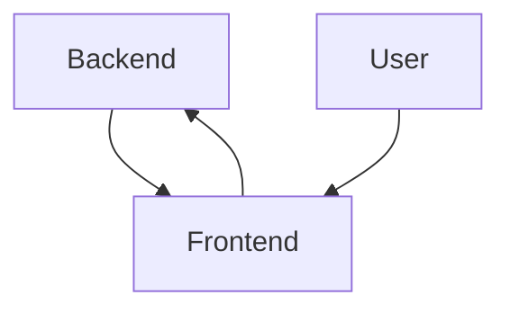

# Hack of the week - Server Driven MUI

I became curious about server-driven UI patterns as a way to improve the iteration cycles of app developers. They're
most popularly seen in iOS or android apps - if the app is not at all server driven, a new feature or A/B test needs a
new app version which includes a lengthy deployment process and a potentially disruptive upgrade workflow for customers
before that new feature is available to them. In my own day job, I find admin UIs particularly annoying to work with -
my systems have admin UI services for some CRUD APIs of backend services, and any change to the data model needs
another change to the UI repo that's just tedious (the value for the amount of time put in just doesn't seem worth it)

I also thought this was a fun and low-risk project to exercise thinking in terms of systems programming. I resonated
with [Andrew Kelley](https://andrewkelley.me) the creator of zig about what systems programming entails:
[Making Systems Programming Accessible by Andrew Kelley](https://youtu.be/Qncdi-Fg0-I?si=LF6hyrYCYsV4lpyQ&t=570) - that
systems programming is designing a system and providing an API to transform and modify the system. This server-driven UI
app seemed like great practice to create a system containing a frontend server, a backend server, and a language with
which they communicate, create, update and delete UI components



The tools and API that update this system have to do with the process of adding new components to the frontend, and
finding a systematic way to update the backend in a way that easily uses the new components in a decoupled manner

> Note: while a content management system like wordpress can count as server-driven UI, what I'm building here is more
> flexible and customizable. A backend server in this system will determine individual components and layouts, not just
> the text and media that should populate specific boxes in a predetermined layout

## Research to build this system

Most UI farmeworks use a component model that uses some representation of a tree of components. At the lowest level,
the HTML DOM tree is the component tree that contains all the information of what's shown on screen (SolidJS does
this). A lot of frameworks have a representation that's in javascript, in particular react uses a tree of objects
containing props and children which powers the virtual DOM. I'm familiar with this, so we'll be playing with nextJS in
this hack

A react component representation is made using a createElement method (which is what babel desugars JSX into):

```jsx
// JSX like this
<h1>Hack of the week - Server Driven MUI</h1>

// becomes
createElement(
  "h1",
  null,
  "Hack of the week - Server Driven MUI"
)
```

A functional component can be given to the `createElement` function also, and the children can be a string, undefined, or a list of react elements:

```jsx
function FancyTitle({ props, children }) {
  return <div style={{ fontSize: props.size }}>
    {children}
  </div>
}

// JSX like this
<FancyTitle size="5em">
  <h1>Heading</h1>
  <p>text</p>
</FancyTitle>

// becomes
createElement(
  FancyTitle,
  {"size": "5em"},
  [
    createElement("h1", null, "Heading"),
    createElement("p", null, "text")
  ]
)
```

We can leverage this to render items dynamically from the server. We'll have the server return the name of the
component properties and children to include to render the component.

#### Component library: Material UI

Material UI is a mature collection of react components. I figured I could use this library to reduce the development
overhead. No need to come up with a layout or UI on my own, just use some of the pre-made components and keep it
simple. They also have plenty of sample code to work with

## Implementation

I took a step by step approach building a frontend UI and working backwards by powering it with data sent from the
backend. I designed a simple API for having a server return information about components, and a simple way for a
front-end application to call a backend service to fetch the components to render

#### Step 1 - create a frontend, a target to build towards

I created a simple nextjs server serving a page with a few sample elements creating a table of calorie information.
This was the target - what I wanted to dynamically create with layout information sent from a backend server:


I used the example code presented in [this example here](https://mui.com/material-ui/react-table/), the component
tree contained basic html elements like div and h1 and some material UI components that have to do with tables.

#### Step 2 - a python service which dictates which components to show

Next I built a nextjs app which calls a tiny backend service to fetch the components to render in json format and render
a page with components based on that json response body

Before I built a python service, I created a mock json response with enough information I'd need to render the above
table correctly. To render a component, I need:
 * a string html element name, string body, or component class
 * some props
 * a list of children
This can be done with a simple enough representation model. Something that looked like this (you can see the full tree
of components represented in json
[here](https://github.com/thenomadlad/server-driven-mui/blob/main/sdmui-python/app.py#L34)):

```json
[
  {
    "component": "TableContainer",
    "props": {"component": "Paper"},
    "children": [
      {
          "component": "Table",
          "children": [
            // ...
```

The front end rendering code was straightforward after representing the components to render using the above structure:

```tsx
import { createElement } from "react";

interface SduiData {
  component: string;
  props?: { [k: string]: string };
  children?: SduiData[] | string;   // each child can either be some text, or a component
}

function renderSduiComponent(
  sdui_data: SduiData[] | string | undefined
): React.ReactElement[] | string | undefined {
  if (sdui_data === undefined || typeof sdui_data === "string") {
    return sdui_data;
  }

  return (sdui_data as SduiData[]).map((sdui_piece) =>
    createElement(
      /* COMPONENT CLASS NAMED `sdui_data.component` */,
      sdui_piece.props,
      renderSduiComponent(sdui_piece.children)
    )
  );
}
```

I looked up a couple of ways to resolve a component's class from the string `sdui_data.component` field. However, for
simplicity's sake, I've decided to create a map of supported component classes, and find it by string name:

```tsx
SDUI_COMPONENTS = {
  Table: Table,
  TableBody: TableBody,
  // ... more component classes
}

// ...

createElement(
  SDUI_COMPONENTS[sdui_data.component] as FunctionalComponent,
  sdui_piece.props,
  renderSduiComponent(sdui_piece.children)
)
```

Once I got the above to work, I made a simple python flask server which returns the comopnent tree in json format:

```python
from flask import Flask, jsonify

app = Flask(__name__)

@app.route("/raw_structure_demo/_sdui", methods=["GET"])
def sdui_raw_data():
    return jsonify(
        [
            {
                "component": "TableContainer",
                "props": {"component": "Paper"},
                "children": [
                    {
                        "component": "Table"
                        # ... more children
          ]
    )
```

Once I started the python app at port 5000, I had the nextjs app's index page perform a
`fetch("localhost:5000/raw_structure_demo/_sdui")` on page load and passed the json response body to the above
`renderSduiComponent` function

#### Step 3 - have the frontend dynamically call the backend

I wanted to make the frontend app be the entrypoint with which the backend could be called. This meant some way to tell
the frontend service call a url, port and endpoint of the backend server.

Once again just by looking at the minimum information needed, I used the simplest representation possible for telling
the frontend to call the backend: using a URL pattern which includes protocol, url, port and endpoint:

```
http://localhost:3000/http/127.0.0.1:5000/raw_structure_demo
```

This just needed me to configure the nextjs app to handle a dynamic route with all those parts:


This results in an experience like so:


#### Step 4 - adding another component to he mix

Now I wanted to create a new component which could be added to this system. I created a NiceTable component which
encapsulated the same UI as above in one component. I modified the python code to add another endpoint which
returned only one component:

```python
@app.route("/nice_table_demo/_sdui", methods=["GET"])
def sdui_nicetable():
    return jsonify(
        [
            {
                "component": "NiceTable",
                "props": {
                    "headings": [
                        "Dessert (100g serving)",
                        "Calories",
                        "Fat (g)",
                        "Carbs (g)",
                        "Protein (g)",
                    ],
                    "rows": [
                        {
                            "name": "Frozen yoghurt"
                            "calories": 169
                            "fat": 6.0
                            "carbs": 24
                            "protein": 4.0
                        },
                        # .. more rows
                    ],
                },
            }
        ]
    )
```

To make this work, I needed to add another component NiceTable to the frontend server. I want to spend some time
thinking about the workflow a developer would have to ideally go through to easily add a component to an existing
running server-driven UI frontend server. However, for this week's hack, I decided to just add the component to the
frontend server directly

First I created the component class in the nextjs server, and then added the component to the map of components that
could be rendered:

```tsx
const SDUI_COMPONENTS = {
  // ... other components
  NiceTable: NiceTable
}
```

And.. that was it! When I went to the url `localhost:3000/http/localhost:5000/nice_table_demo`, I saw this:


That was really satisfying to see, however, there must be an easier way for developers to register the components that
can be rendered by the frontend system.

## Learnings

The biggest advantage of this system is that the UI and backend systems are decoupled in a way that increases speed of
iteration. It's the kind of decoupling which lets the frontend and backend halves of the system evolve at their own
pace, as long as they share a common contract.

Another advantage I noticed is that since the backend determines the UI layout and the frontend doesn't need a
coordinated deployment, the backend can also roll back its changes without the frontend ever needing any coordination
either

A huge downside is the inability to cache and precompute pages. This makes all layouts dynamic without prerendering.
Although there are probably ways to perform caching and preloading to minimize the impact, the fundamental nature of
the system, that a backend system defines the components necessarily means that the frontend can't be cached.

One additional downside to this approach has to do with the dynamic nature of this system, we could introduce security
issues when dynamically loading modules
  
## Next steps

There are some large parts of the common contract that still need to be defined, specifically the language to define
layouts and user actions. I also think there's room to explore using the same language to build larger components.
For example, if a form component can be determined by using the language created using input boxes and buttons instead
of writing new react code

Finally, I think I need to think through the product problem - especially where these experiments fit into the larger
ecosystem of CMSs and server driven UI frameworks. I see value in using this in developer ecosystems, for example by
backend teams that own admin UIs or tools which can be rendered without owning any frontend code.
