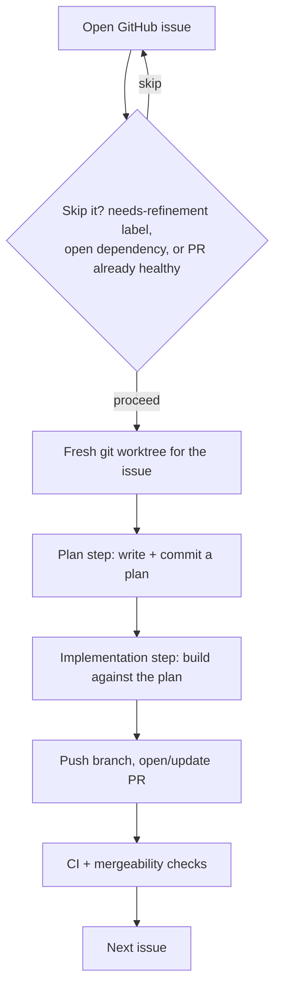

Retrofit UI is a server-driven UI framework aimed at developers. The idea: a
backend developer should be able to expose an admin interface for their service
by adding a few endpoints — no frontend code required, unless you really want to opt into the complexity. Point the app at those
endpoints and it renders forms, tables, and navigation from the data the backend
describes.

The itch is the same one that started server-driven MUI: admin UIs at my day
job are a specific kind of annoying. Any change to a backend service's data
model means a matching change in a separate frontend repo, just to keep some
CRUD screen in sync — a screen nobody spends real design effort on to begin
with. The amount of tedium never matched the value delivered. Server-driven
UI seemed like the actual fix: let the backend that already owns the data
model also own what gets shown for it, instead of a frontend team re-deriving
that shape by hand every time it changes.

This is a rebuild of an earlier experiment called
[server-driven MUI](/blog/hotw-002-server-driven-mui). That version got the idea
working but was rough — Python backend, no tests, manually constructed JSON
component trees. All it did was send a JSON representation of high level react component and leave it to the front end to build the rest of the component tree

I came back to it in late December 2025 and started over with a
clearer design:

- a spec to represent components -- one that is easy to extend and utilize
- a front end implementation of that spec (I used SolidJS and shoelace components just for learning)
- two implementations of providers of the spec, backends for app developers to use:
  - a static renderer which I used in the documentation page
  - a spring-boot server library which can be used by java servers to declare data


## How it works

The core of it: the backend derives a UI spec from its own data schema and
serves it alongside the data. The frontend reads the spec and renders
accordingly — no hardcoded component knowledge on the backend, no custom JSON
format to invent.

Here's what a table view endpoint looks like:

```ts
import { zodToJsonSchema } from "zod-to-json-schema";

const jsonSchema = zodToJsonSchema(BookSchema);
const updateSchema = zodToJsonSchema(UpdateBookSchema);

const view = TableView.fromSchema(jsonSchema, "Books")
  .forUpdateCommand(updateSchema)
  .editUrlTemplate("/sdmui/book/{$.isbn}")
  .buildForPage(page); // page of rows of data

return res.json(view);
```

The frontend receives a `TableViewSpec` (or `FormViewSpec`) and a page of data,
and renders accordingly. No component name strings, no manual JSON construction.

### The `forUpdateCommand` pattern

Editability is controlled by passing a separate schema for what can be updated.
Fields present in the full schema but absent from the update schema render as
read-only — no per-field annotations needed, the constraint comes from the type
system.

```ts
// Full schema has `isbn`, `name`, `author`, `year`, `purchaseLink`
// Update schema only has `name`, `year`, `purchaseLink`
// → isbn and author render as read-only automatically
FormView.fromSchema(fullSchema, "Book")
  .forUpdateCommand(updateSchema)
  .buildForEntity(book);
```

## How it's different from the original

The original worked by having the backend manually construct a JSON tree of
component names and props:

```json
[{ "component": "NiceTable", "props": { ... }, "children": [...] }]
```

The frontend walked that tree and called `createElement` on each node, mapping
component name strings to actual React components. It was clever but brittle —
adding a component meant updating the map, and the JSON had no validation.

The new version inverts this. Instead of describing components, the backend
describes _data_. The frontend figures out how to render it.

Three other differences worth noting:

**TypeScript all the way down.** The original needed a Python backend to
generate the JSON. The new version is pure TypeScript/Express — everything runs
with one `pnpm` invocation.

**Test infrastructure from day one.** The original had no tests. Retrofit UI
starts with Playwright E2E tests that spin up a test server and exercise the
rendered UI. Each prototype has a spec document listing test scenarios before
any implementation.

**JSON Schema as the contract.** Rather than a bespoke component language, the
backend derives the UI spec from its existing Zod types. The schema is already
there; Retrofit UI just uses it.

```json
[{ "component": "NiceTable", "props": { ... }, "children": [...] }]
```

The frontend then walked that tree and called `createElement` on each node, with
a lookup table mapping component name strings to actual React components. It was
clever but brittle — adding a new component meant updating the map, and the JSON
structure had no validation.

The new version inverts this. Instead of describing components, the backend
describes _data_. The frontend figures out how to render it.

### JSON Schema as the contract

The key insight is that the backend already has a schema for its data — usually
as a Zod or TypeScript type. Rather than inventing a component language, you
derive the UI spec from that schema:

```ts
import { zodToJsonSchema } from "zod-to-json-schema";

const jsonSchema = zodToJsonSchema(BookSchema);
const updateSchema = zodToJsonSchema(UpdateBookSchema);

const view = TableView.fromSchema(jsonSchema, "Books")
  .forUpdateCommand(updateSchema)
  .editUrlTemplate("/sdmui/book/{$.isbn}")
  .buildForPage(page); // page of rows of data

return res.json(view);
```

The frontend receives a `TableViewSpec` (or `FormViewSpec`) and a page of data,
and renders accordingly. No component name strings, no manual JSON construction.

### The `forUpdateCommand` pattern

One thing I liked a lot: editability is controlled by passing a _separate_
schema for what can be updated. Fields present in the full schema but absent
from the update schema render as read-only. You never annotate individual
fields; the constraint comes naturally from the type system.

```ts
// Full schema has `isbn`, `name`, `author`, `year`, `purchaseLink`
// Update schema only has `name`, `year`, `purchaseLink`
// → isbn and author render as read-only automatically
FormView.fromSchema(fullSchema, "Book")
  .forUpdateCommand(updateSchema)
  .buildForEntity(book);
```

### TypeScript all the way down

The original had a Python backend to generate the JSON. The new version drops
that — both the test servers and the framework are pure TypeScript/Express. The
Python layer added friction and made the project harder to run locally. Removing
it meant everything was one `pnpm` invocation.

### Test infrastructure from day one

The original had no tests. The new version starts with Playwright E2E tests that
spin up a test server and exercise the actual rendered UI. Each prototype has a
spec document that lists the exact test scenarios before implementation starts.

## The build

I started fresh on December 28, spending the first day on scaffolding: GitHub
Actions CI, Playwright config, the routing skeleton, and the docs directory with
prototype specs. No application code.

Prototype 1 (single entity form view) started December 29. The commits across
that stretch are the honest record of iterative work:
`First attempt at prototype-1`, `Have stuff`,
`Most of the first prototype is done woo`, then immediately back into
`Partial changes`, `Partial update`, `Reversions`. Delete operations for arrays
were messy enough to warrant their own commit message:
`Delete array kinda works now`. `Finally got it all working for proto1` landed
January 8.

Table view (prototype 2) came together faster — `Table view works` on January
11, just three days after the form view landed. The pattern was established;
applying it to a new view type was mostly mechanical.

The latest commit is called `What did i even do`. That's where things stand —
something exploratory is in progress and I haven't decided if it's worth
keeping.

<!-- TODO: Screenshot of the table view / form view in action. The nice-table-component-demo from the original post shows the old version; would be good to have a side-by-side or a fresh screenshot of proto2 running. -->

## Key Learnings

### Ship fully-formatted data with the spec, not just the shape

A table cell carries both the raw value and a pre-computed display string —
`{ value: 1234.56, formatted: "$1,234.56" }` — rather than shipping raw
values and leaving the frontend to apply `Intl` formatting itself. It sounds
like a small thing, but it means locale/currency/date formatting lives in one
place (the server) instead of being re-implemented per renderer, and a
Python or Java backend gets output identical to a TypeScript one without
agreeing on a shared formatting library. The renderer's job shrinks to
"print `cell.formatted` if present, else `String(cell.value)`" — no
formatting logic of its own, and no renderer lock-in to something like a
web-component's built-in number formatter.

Concretely, one response for a table of expenses looks like this — and the
renderer never touches a locale or currency symbol:

```json
{
  "columns": ["Vendor", "Amount", "Date"],
  "data": [
    {
      "vendor": { "value": "Acme Corp" },
      "amount": { "value": 1234.56, "formatted": "$1,234.56" },
      "date": { "value": "2026-06-14T12:00:00Z", "formatted": "Jun 14, 2026" }
    }
  ]
}
```

| Vendor    | Amount    | Date         |
| --------- | --------- | ------------ |
| Acme Corp | $1,234.56 | Jun 14, 2026 |

The renderer reads that table top to bottom and prints `formatted` where
it's present. A Python or Go backend emitting the same shape gets the exact
same rendered table — no shared `Intl` library, no client-side locale logic
to keep in sync across languages.

### Dogfooding surfaced real design gaps that spec-writing alone didn't

Building the docs page, a demo app called chalk-app, and eventually the
project's own landing page — all rendered *by* Retrofit UI's own spec system
— forced decisions that stayed theoretical otherwise. The landing page push
added composable `flex`/`grid` layout containers (so a page can be built
from nested layout primitives instead of one flat list of views) and a
proper nav shell — a hand-rolled sidebar first, then rebuilt on Shoelace's
`sl-drawer`, which handles the backdrop, focus trap, and Escape-to-close for
free and dropped about 40 lines of custom CSS. Every SPA now gets a default
"Home" nav item without a server needing to declare anything — opting out is
the explicit path, not opting in. None of that was in the original design;
it only showed up because the framework had to render something real.


The page above isn't hand-authored HTML — it's a `PageSpec` served like any
other Retrofit UI response and rendered by the same client that renders a
consumer's admin table. If the framework couldn't handle its own marketing
page cleanly, that would have been a real signal.

### AI harnesses can be built easily with spec-driven development

`scripts/implement-issues.sh` picks up open GitHub issues and works through
them autonomously — one Claude call to write and commit a plan, a second to
implement against it, then a normal PR lifecycle: push, open/update the PR,
check CI and mergeability, and loop to the next issue. Issues can declare
dependencies on each other in plain text ("Depends on #42"), and the harness
skips anything still blocked or already healthy, so re-running it is safe
and idempotent rather than something that needs careful babysitting.



The reason a spec-driven project makes this tractable: the harness doesn't
need to understand the whole codebase to act correctly, it needs the same
thing a `TableView` builder needs — a declared contract (the issue, the
plan, the PR's CI status) it can reconcile against, one step at a time. The
same idea that shows up in the framework's own design — declare a spec, let
something else reconcile it — turns out to apply recursively to how the
framework gets built.

<!-- TODO: diagram — the harness's loop (issue → spec → implementation → changeset), or a screenshot of it running. -->

## What's next

The roadmap calls out two more things worth doing: better handling of nested
objects in forms, and a way to define navigation between views (so clicking a
row in a table can load the form view for that row without hardcoding the URL
pattern on the backend). The `editUrlTemplate` is a start but it's a string
template, not typed.

Building several example apps side by side surfaced a real drift problem,
too: each example had two hand-maintained copies of its spec — an Express
server building it with the fluent builder API, and a separate docs demo
constructing the same shape as a plain object literal. They drifted silently;
one docs demo broke when a spec shape changed in `core` but its hand-copied
version didn't get updated. The fix was extracting the actual spec-building
code into a shared module each side imports — the server thins to just
Express wiring, the docs demo calls the same builder. Any future spec-shape
change now breaks the docs build at compile time instead of failing silently
at runtime, and about 360 lines of duplicated spec construction disappeared.

The original question — whether a developer can build a working admin UI by
writing only backend code — has a cleaner answer now: yes, for the cases the
prototypes cover. The gap is still the long tail of UI patterns that don't fit
form-or-table.
